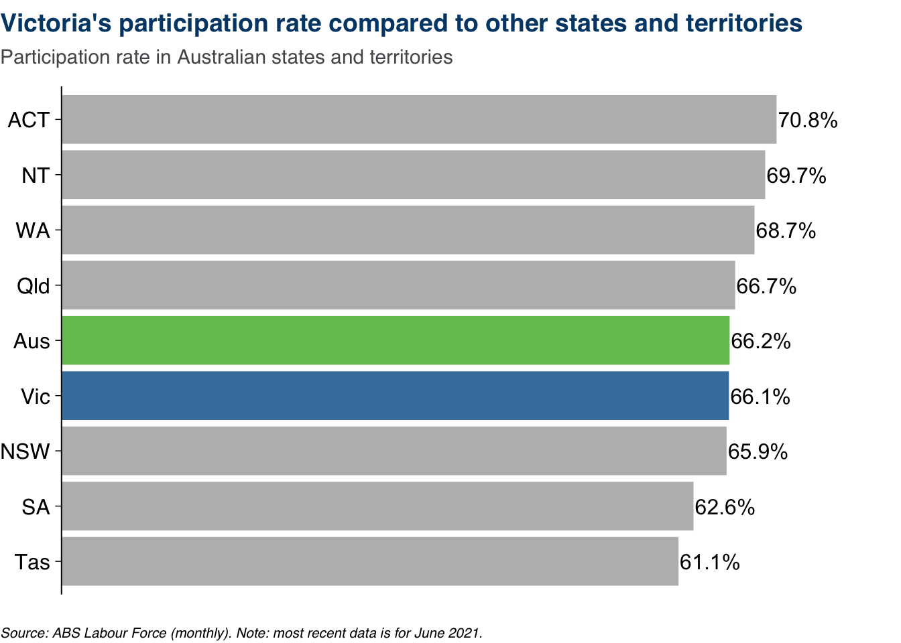

<!-- README.md is generated from README.Rmd. Please edit that file -->

# djprlabourdash

<!-- badges: start -->

[](https://lifecycle.r-lib.org/articles/stages.html#experimental)
[](https://github.com/djpr-data/djprlabourdash/actions)

<!-- badges: end -->

## Overview

The `djprlabourdash` repository contains the code for the DJPR Jobs
Dashboard. This dashboard is made in R with the [Shiny
package](https://shiny.rstudio.com).

The dashboard provides an overview of the Victorian labour market using
publicly-available data. It is created and maintained by the Data +
Analytics team in DJPR Strategy and Priority Projects. **Note that all
data currently displayed on the dashboard is publicly-available data.**

The [live dashboard is hosted at
Shinyapps.io](https://djpr-spp.shinyapps.io/djprlabourdash/).

`djprlabourdash` is structured as an R package. This facilitates easier
unit testing and code structure.

## Related repos

`djprlabourdash` depends on several related R packages:

-   [`djprdashdata`](https://github.com/djpr-data/djprdashdata) contains
    the data used in this app, as well as the code to update that data;

-   [`djprshiny`](https://github.com/djpr-data/djprshiny) contains
    common code used across DJPR Data + Analytics Shiny apps;

-   [`djprtheme`](https://github.com/djpr-data/djprtheme) is a ggplot2
    theme package that implements the DJPR visualisation style guide.

## Installation

Install `djprlabourdash` and its dependencies with:

``` r
# install.packages("devtools")
devtools::install_github("djpr-data/djprlabourdash", dependencies = TRUE)
```

## Git branch structure and deployment

There are three types of branches in this repository:

1.  The `main` branch contains the code corresponding to the current
    live dashboard.

2.  The `dev` branch is the main working branch for the repository. This
    is where contributions by different people are integrated and tested
    before being deployed to the live dashboard.

3.  Feature branches are created by project contributors to add or
    modify the dashboard’s functionality.

``` r
# drawn at https://app.diagrams.net/
```


When any changes are made in `main`, an automatic process is triggered
via GitHub Actions that re-deploys the Shiny web app - ie. the live
dashboard is updated to reflect any changes made in `main`. Changes to
`main` are almost always made via pull requests from `dev`. The only
exception to this are urgent ‘hotfix’ changes made by the project
administrator.

Code from project contributors is always added in ‘feature branches’
which are then merged into `dev`, tested, then merged into `main`.

## Folder structure and key files

Because `djprlabourdash` is structured as an R package, the folder
structure reflects R package conventions. These include:

-   All functions in the package live in files ending in `.R` in the
    `/R` subfolder of the package.

-   Documentation for individual functions lives in `.Rd` files in the
    `/man` subfolder of the package. These are created automatically
    based on [special comments in .R
    files](https://r-pkgs.org/man.html?q=roxy#roxygen-comments) and
    should not be edited directly.

-   Code to create data used by the package (‘internal data’) is saved
    in `/data-raw`. This folder also contains some code (‘scratchpads’)
    that is used to test certain functions and can ultimately be
    discarded.

-   Tests that ensure functions do what they are expected to do are
    saved in `/tests`.

There are some other files and folders of note:

-   [DESCRIPTION](https://r-pkgs.org/description.html#pkg-description)
    is a file included in all R packages that descriptions what the
    package does, who created it, and what other packages the package
    depends on (‘imports’). Package contributors should generally not
    edit this file directly - if an additional package needs to be
    added, use `usethis::use_package("packagename")`.

-   [NAMESPACE](https://r-pkgs.org/namespace.html?q=NAMESPACE#namespace)
    is another file included in all R packages. It tells R which
    functions from this package should be made available to users
    (“exported”) and which functions from other packages should be
    available to this package (“imported”). It shouldn’t be directly
    edited.

-   `/.github` contains code for GitHub to execute using [Github
    Actions](https://docs.github.com/en/actions). This includes
    instructions to check the package (using [R CMD
    check](https://r-pkgs.org/r-cmd-check.html)) to make sure that it
    passes all the built-in tests and does what an R package is expected
    to do - this is done whenever anyone initiates a pull request to the
    `main` or `dev` branches. It also includes instructions to deploy
    the dashboard to shinyapps.io whenever anything is changed in the
    `main` branch. Package contributors should not edit these files.

-   `/rsconnect` contains information used as part of the deployment of
    the dashboard to shinyapps.io. These files are created automatically
    and should not be directly edited.

## Code structure

As noted above, all functions live in the `/R` folder of the package.
The key files for contributors to be aware of are:

-   Files starting with `viz_` contain functions to make the graphs on
    the dashboard.

-   Files starting with `page_` define the user interface for individual
    pages of the dashboard.

-   The `labour_app.R` file contains the server-side code for the Shiny
    app.

There are some other files related to tables and utility functions.

### `viz_` files

Most contributions to the dashboard will come in the `viz_` files. These
contain the code that creates the graphs on the dashboard.

Each graph has its own function. These functions all **must start with
`viz_`**. The general naming convention is:

`viz_page_content_charttype()`

where:

-   `page` is an abbreviated version of the page name - like `ind` for
    the Indicators page;

-   `content` provides some indication of the subject of the chart, like
    `partrate` for a chart of the participation rate; and

-   `charttype` indicates the type of chart, such as `bar` for a bar
    chart.

So the `viz_ind_partrate_bar()` function, for example, produces this
chart:

``` r
djprlabourdash:::viz_ind_partrate_bar()
```


